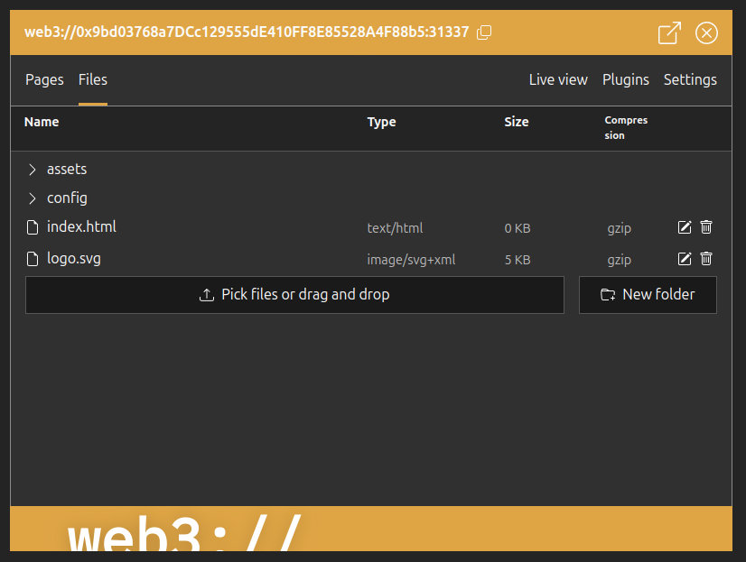
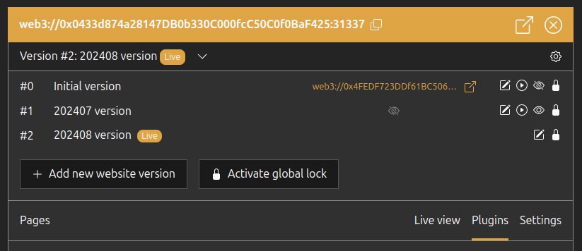
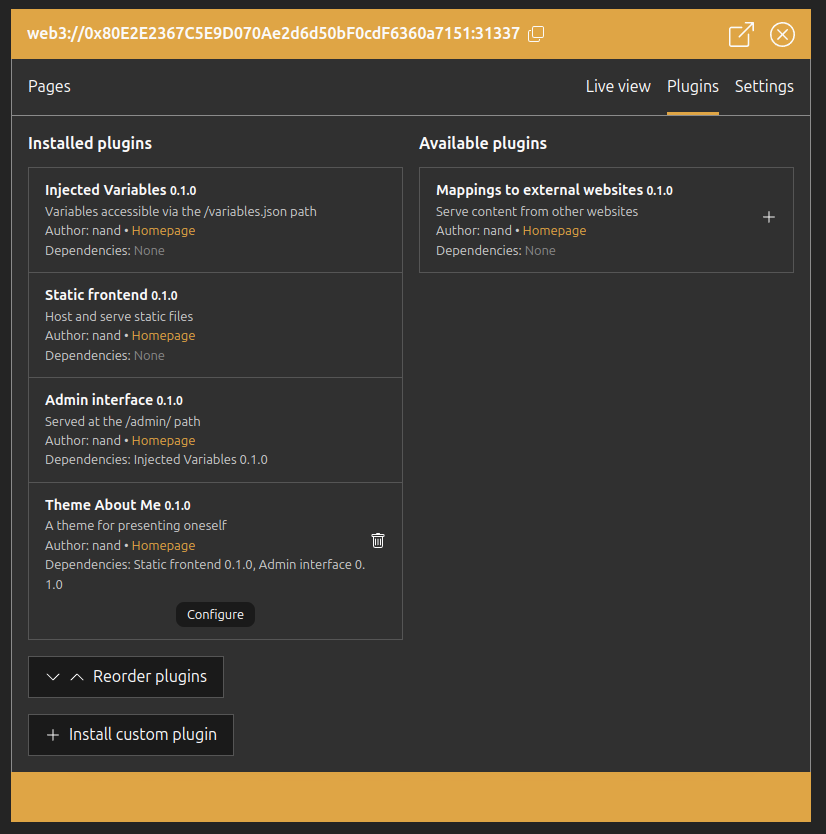

# OCWebsite && web3://ocweb.eth

`web3://ocweb.eth` ([HTTPS gateway link](https://ocweb.eth.eth.web3gateway.dev/)) is a [`web3://`](https://docs.web3url.io/) website which lets you mint OCWebsites.

## ``web3://`` protocol

In short, ``web3://`` is like ``https://``, but websites are smart contracts, and the blockchain is the server. This is standardized by [several Ethereum ERCs](https://docs.web3url.io/web3-url-structure/base#standards). Learn more with the [presentation website](https://web3url.io) and [documentation website](https://docs.web3url.io/). Try live with the [``web3://`` sandbox](https://w3-sandbox.eth.eth.web3gateway.dev/). Download the [native EVM Browser](https://github.com/web3-protocol/evm-browser) or learn about the [HTTPS gateways](https://docs.web3url.io/web3-clients/https-gateway).

## OCWebsites

OCWebsites are ``web3://`` websites prepackaged with a plugin system (themes, features, ...), a versioning system and an admin interface. They appear as NFTs in your wallet.

They are useful for both : 

- Developers: ability to upload a frontend (via admin or CLI) to your OCWebsite, manage multiple versions (switch live version), create and add your own plugins
- Non-developers : Use the admin interface to configure themes, add and publish pages (at the moment, only one theme available)



## ocweb CLI

``ocweb`` is a CLI tool to interact with OCWebsites. Install it with ``npm i ocweb``

```
ocweb [options] <command>

Commands:
  ocweb mint <chainId> <subdomain>          Mint a new OCWebsite on a blockchain
  ocweb list <chainId>                      List the OCWebsites owned by the wallet
  ocweb factory-infos <chainId>             Advanced: Show infos about the factory contract
  ocweb version-ls                          List the versions of the OCWebsite
  ocweb version-add [title]                 Add a new version in the OCWebsite
  ocweb version-set-live <website-version>  Set the live version of the OCWebsite
  ocweb version-set-viewable <isViewable>   Set the live version of the OCWebsite
  ocweb upload [arguments..]                Upload a static frontend to the website. Require the Static Frontend plugin installed.
  ocweb ls [folder]                         List the files in the static frontend
  ocweb rm <files..>                        Remove a file from the static frontend

Options:
      --help                Show help                                                                                              [boolean]
      --version             Show version number                                                                                    [boolean]
  -r, --rpc                 Override the default RPC provider URL. Example: https://your.provider.com/                              [string]
  -k, --private-key         The private key of the wallet to use for signing transactions (Environment variable: PRIVATE_KEY)       [string]
      --skip-tx-validation  Skip the validation prompt for transactions. WARNING: This will make you sign transactions right away. Use with
                            caution.                                                                              [boolean] [default: false]
```

### Example CLI use: Upload a static frontend

Mint an OCWebsite, build your static frontend and execute the following command:

```bash
PRIVATE_KEY=0xabc...def \
npx ocweb upload --web3-address web3://0xab...cd:10 dist/* / --sync
```

where:
- `PRIVATE_KEY=0xabc...def` is the private key of the Ethereum account that will do the uploading. Must be the owner of the OCWebsite.
- `web3://0xab...cd:10` is the `web3://` address of your OCWebsite
- `dist/` is the folder containing your static frontend files
- `--sync` is optional, and indicate that files that are on the OCWebsite, but not on the local `dist/*` folder, will be deleted. Useful for an update.

## OCWebsite versioning

New OCWebsites comes with an initial version. You can create a new version anytime, which will duplicate another version. Each version is totally independant, including the installed plugin list and their configuration.

- You can change the version being the live version served by your OCWebsite.
- You can enable a viewer for non-live versions, in order to preview them, and/or to make available a historical version.
- You can lock a version, which becomes immutable.



## OCWebsite plugins

Several plugins come pre-installed with a newly minted OCWebsite.



## Local deployment for development

To build and deploy locally, you will need [Foundry](https://getfoundry.sh/).

### Installation

```bash
git clone git@github.com:nand2/ocweb.git
cd ocweb
git submodule init
git submodule update --init --recursive
npm ci
cp .env.example .env
```

Edit `.env`, add on `PRIVATE_KEY_LOCAL` the private key of the first account of anvil (the local dev blockchain of Foundry) (private key written when you run `anvil`).

### Local deployment

```bash
./scripts/deploy.sh
```

It will output the `web3://` address of the factory website, to view with [EVM Browser](https://github.com/nand2/evm-browser) or with a [web3protocol-http-gateway](https://github.com/web3-protocol/web3protocol-http-gateway-js).

Note: A `forge clean` (cleaning of the previously compiled contract) may be required (due to OpenZeppelin Upgrade script checks).

### Local developer server of web3://ocweb.eth

`web3://ocweb.eth` is a Vite-based Vue project. To launch its developer server, 

- Make a local deployment as explained in the previous section
- At the end of the `./script/deploy.sh` output, note the address of the OCWebsiteFactory contract, and of the factory website.
- Edit [variables.json](https://github.com/nand2/ocweb/blob/master/frontend-factory/public/variables.json): put the address of the OCWebsiteFactory in the `factory-hardhat` field (keeping the `:31337` at the end), and the address part (without `web3://`) of the factory website in the `self` field.
- Run `npm run dev-factory`

## Develop your own OCWebsite plugin

See the [plugin documentation](./docs/plugins.md)
